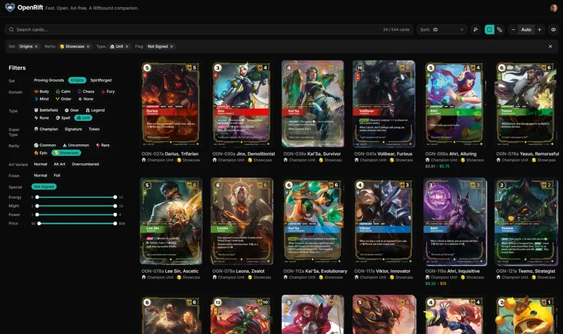

# OpenRift

An open-source collection tracker and deck builder for [Riftbound](https://riftbound.leagueoflegends.com/), League of Legends' trading card game.

_Built with Fury. Maintained with Calm._

> Built in 2026. Live, actively developed, and improving fast. See the [changelog](apps/web/src/CHANGELOG.md).

**[openrift.app](https://openrift.app)** · [Help](https://openrift.app/help) · [Roadmap](https://openrift.app/roadmap) · [Discord](https://discord.gg/Qb6RcjXq6z)

## Why

I wanted to track my collection, and nothing I tried fit. One site was missing cards, another felt slow on mobile and dropped cards mid-edit, a third had every feature but the basics didn't feel solid. And none of them worked well on both desktop and mobile. So I built the card browser I wanted to use.

The [honest comparison](https://openrift.app/help/why-openrift) lays out where OpenRift stands next to the alternatives.

## What it does

- **Every card, every printing.** Complete catalog including Chinese printings and promos, with daily prices from TCGplayer, Cardmarket, and CardTrader shown side by side.
- **Collection tracking that mirrors real life.** Name collections after where cards actually live, like "Red Deck Box", "Binder 1", or "Lent to Sebastian". Every copy lives in exactly one place.
- **Deck builder that knows what you own.** Format validation, energy curves, deck codes. See what you're missing and print the rest as proxies.
- **Yours to keep.** Open source (AGPL-3.0), ad-free, no tracking beyond cookie-free Umami analytics. Export to CSV any time, or self-host the whole stack.

## What it doesn't do

No AI deck suggestions; we don't think everything needs AI shoehorned in. No forums or social network, since content moderation is a full-time job and we're a tool, not a social space. Plenty else is on the [roadmap](https://openrift.app/roadmap), including a mobile app with card scanning. The [honest comparison](https://openrift.app/help/why-openrift) lays out what's there, what's coming, and what isn't.

## For developers

Turborepo monorepo: TanStack Start frontend (`apps/web`), Hono API (`apps/api`), shared types (`packages/shared`), PostgreSQL. Bun, TypeScript end-to-end, Tailwind + shadcn/ui, oxlint + oxfmt.

- [Architecture](docs/architecture.md) — monorepo structure, packages, infrastructure
- [Data Layer](docs/data-layer.md) — database schema and API endpoints
- [Development](docs/development.md) — prerequisites, setup, commands
- [Deployment](docs/deployment.md) — VPS setup, Docker Compose, CI/CD
- [Contributing](docs/contributing.md) — code style, conventions, changelog

Issues and PRs welcome.

## License

[AGPL-3.0](LICENSE)
